# MVP — Engenharia de Dados: Notícias do NYT vs. Câmbio (DXY/USDBRL)

**Autor**: Hernani de Paula Jorge
**Curso**: Pós-graduação PUC-Rio
**Entrega**: 27/09/2026
**Plataforma utilizada**: Databricks Free Edition (Unity Catalog, compute Serverless)

## Contexto de Negócios e Perguntas (Etapa 2 e 4.1)

Este projeto reaproveita o domínio de um trabalho anterior, no qual um investidor fictício (Kevin Koogan) queria entender se notícias do New York Times têm relação com o movimento do dólar americano. Naquele trabalho anterior, a análise foi feita rapidamente em pandas e — como descoberto durante a revisão para este MVP — continha um bug: os dados reais eram carregados, mas em seguida sobrescritos por dados sintéticos (`np.random`), o que invalidava todas as conclusões. Este MVP corrige isso: constrói um pipeline de dados real, em nuvem, com arquitetura em camadas (Bronze/Silver/Gold), a partir de dados efetivamente coletados.

**Problema de negócio**: entender se e como o volume e o sentimento das notícias publicadas pelo New York Times (cobertura geral do jornal, não restrita a economia) se relacionam com o movimento do índice do dólar americano (DXY) e da taxa de câmbio USD/BRL.

**Perguntas específicas**:
- **P1**: Dias com maior volume de notícias têm maior volatilidade do DXY?
- **P2**: O sentimento predominante das notícias está associado à direção do DXY no mesmo dia?
- **P3**: O sentimento das notícias do dia anterior antecipa o movimento do DXY no dia seguinte (efeito de defasagem/lag)?
- **P4**: O comportamento do USD/BRL segue o mesmo padrão observado no DXY?

**Contexto e estrutura dos dados brutos**:

1. *Artigos do New York Times* — extraídos de um banco de dados MySQL próprio (`nyt_db.nyt_articles`), populado previamente com artigos do NYT. Estrutura bruta (7 colunas, 78.002 linhas): `web_url` (chave natural, URL do artigo), `headline` (título), `snippet` (trecho de abertura), `abstract` (resumo), `published_date` (data/hora de publicação, texto), `byline` (autor), `section` (seção do NYT). **Licença**: dados extraídos originalmente via API do NYT para uso acadêmico/pessoal; não redistribuídos publicamente neste repositório (ver item "Dados" abaixo).
2. *Cotações de câmbio (DXY e USD/BRL)* — obtidas via biblioteca `yfinance` (tickers `DX-Y.NYB` e `BRL=X`), 426 e 438 linhas respectivamente, colunas Date/Open/High/Low/Close/Volume. **Licença**: dados públicos do Yahoo Finance, acessados via biblioteca de código aberto `yfinance`, para uso pessoal/educacional (não comercial), conforme os termos de uso do Yahoo Finance.

**Sobre o escopo dos dados**: na etapa de Qualidade de Dados (4.5), verificamos a distribuição de seções dos artigos (`GROUP BY section`) e confirmamos que o dataset é um feed de notícias **gerais** do NYT, e não uma coleta filtrada exclusivamente para conteúdo econômico — artigos explicitamente financeiros (Business + Your Money + The Upshot) somam só ~7,3% do total. Por isso, o problema de negócio foi conscientemente formulado em termos de "notícias em geral", e não "notícias econômicas". Detalhes dessa verificação estão na seção de Qualidade de Dados.

**Dados**: não é necessário disponibilizar os arquivos de dados (conforme item 4 do template). O CSV de artigos não é redistribuído por conter dados extraídos de fonte com uso pessoal; as cotações de câmbio podem ser obtidas livremente executando o notebook `02_bronze_cambio`.

## Carga dos Dados (Etapa 4.2)

**Artigos do NYT**: como o MySQL de origem roda apenas em `localhost` (não acessível pela internet), não foi possível conectar o Databricks diretamente via JDBC. A solução adotada foi exportar a tabela `nyt_db.nyt_articles` para CSV (via MySQL Workbench, usando a exportação do Result Grid para evitar um bug de encoding conhecido da Table Data Export Wizard no Windows) e subir o arquivo para um **Volume do Unity Catalog** (`/Volumes/workspace/default/nyt_articles/`) via `databricks fs cp` (CLI do Databricks, autenticada com `databricks auth login`). O notebook `01_bronze_nyt_mysql` faz a leitura desse CSV a partir do Volume e grava a tabela Delta `bronze_nyt_articles`.

**Cotações de câmbio**: baixadas diretamente em nuvem, sem passar por armazenamento intermediário — o notebook `02_bronze_cambio` usa `yfinance` para baixar as séries DXY (`DX-Y.NYB`) e USD/BRL (`BRL=X`) e grava as tabelas Delta `bronze_dxy` e `bronze_usdbrl`.

**Evidências**:

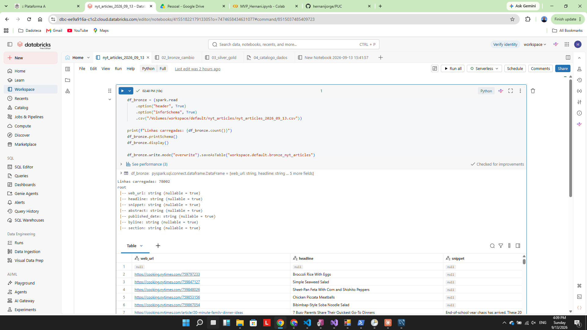
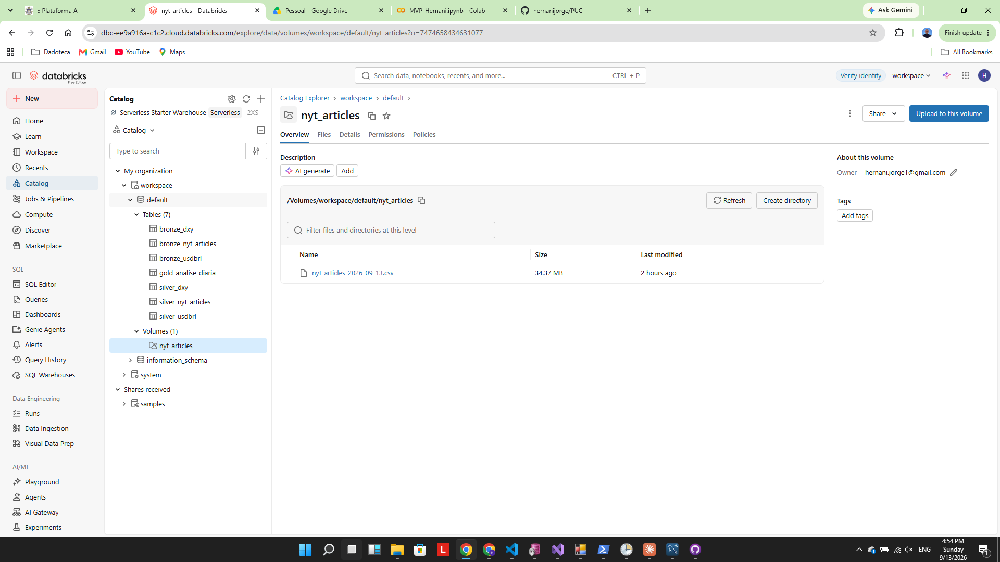
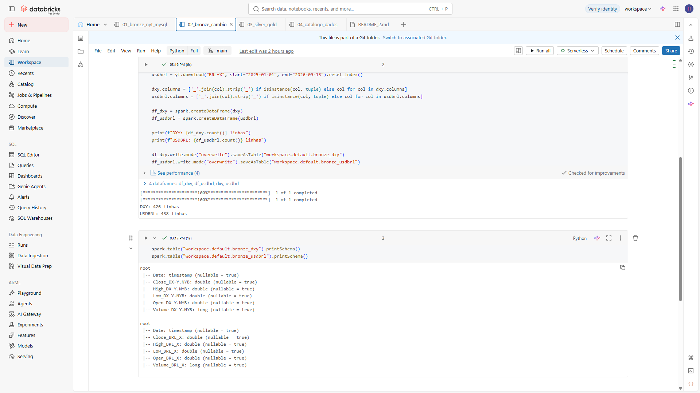

## Modelagem e Catálogo de Dados (Etapa 4.3)

O pipeline segue a arquitetura em camadas (medallion architecture), com todas as tabelas gerenciadas pelo Unity Catalog (`catalog = workspace`, `schema = default`):

| Camada | Tabela | Linhas | Descrição |
|---|---|---|---|
| Bronze | `bronze_nyt_articles` | 78.002 | Artigos do NYT, dado bruto, sem tratamento |
| Bronze | `bronze_dxy` | 426 | Cotações diárias do DXY, dado bruto (yfinance) |
| Bronze | `bronze_usdbrl` | 438 | Cotações diárias do USD/BRL, dado bruto (yfinance) |
| Silver | `silver_nyt_articles` | 77.685 | Artigos limpos, `published_date` tipado e validado, coluna `sentiment` (VADER) adicionada |
| Silver | `silver_dxy` | — | Cotações do DXY com schema padronizado (Date, Open, High, Low, Close, Volume) |
| Silver | `silver_usdbrl` | — | Cotações do USD/BRL com schema padronizado |
| Gold | `gold_analise_diaria` | 401 | Uma linha por dia, interseção entre dias com notícia e dias com cotação; base para a análise final |

**Catálogo de Dados**: todas as tabelas foram documentadas no Unity Catalog com **comentário de tabela** (`COMMENT ON TABLE`) e **comentário por coluna** (`ALTER TABLE ... ALTER COLUMN ... COMMENT`), descrevendo origem, significado e domínio de cada campo relevante — ver script `04_catalogo_dados`. Colunas documentadas da camada Gold: `dia` (chave, granularidade diária), `total_artigos` (quantidade de artigos publicados no dia), `sentimento_medio` (média do score VADER dos artigos do dia, -1 a 1), `dxy_close` (fechamento do DXY), `dxy_return` (retorno percentual do DXY vs. dia anterior), `usdbrl_close` (fechamento USD/BRL), `usdbrl_return` (retorno percentual do USD/BRL), `sentimento_lag1` (sentimento médio do dia anterior, usado para testar antecipação/lag).

**Evidências**:

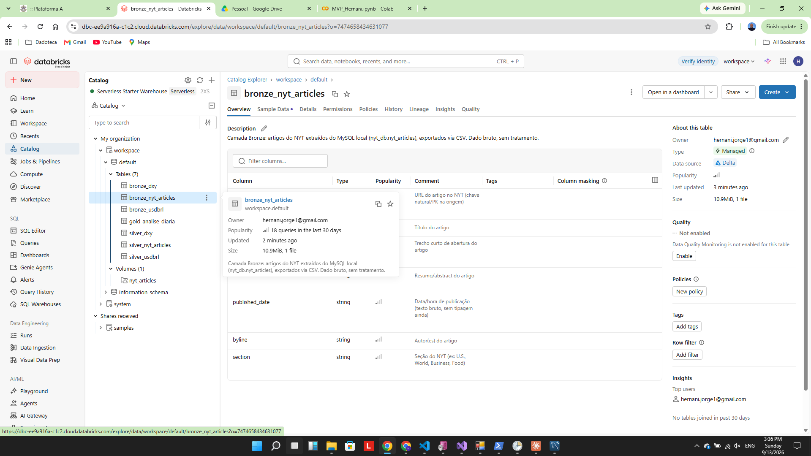
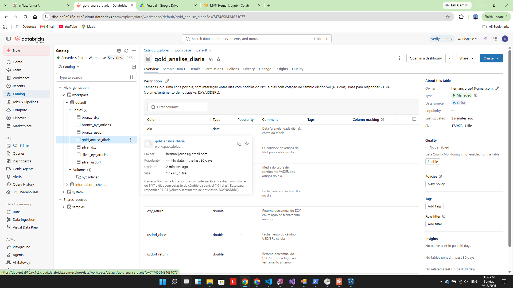

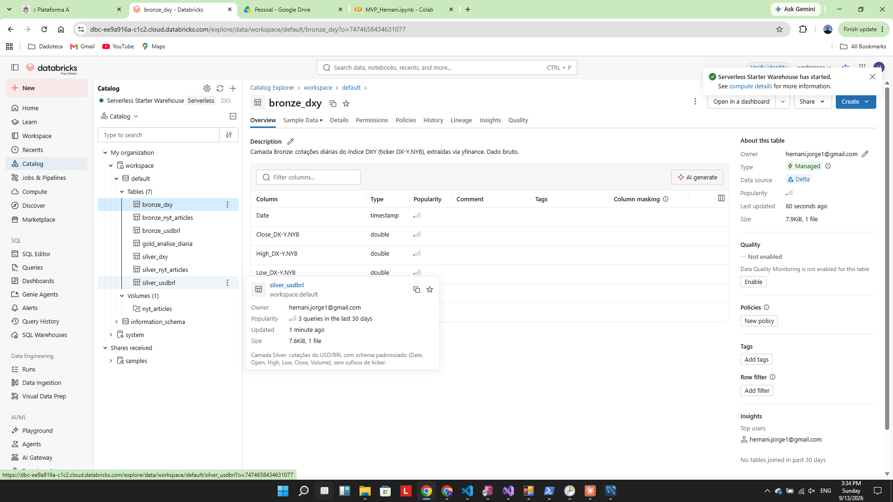
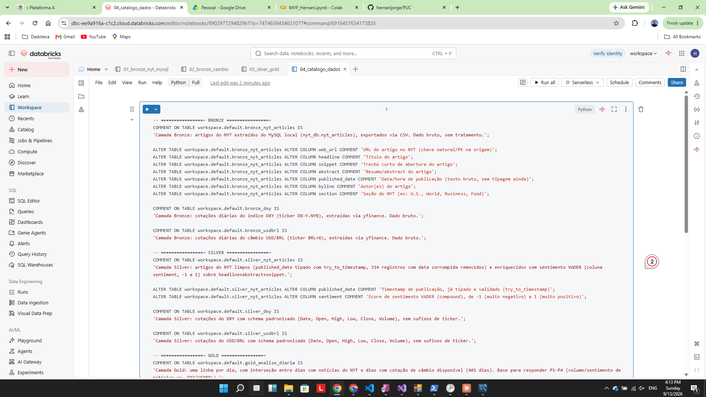

## Pipeline de Dados (Etapa 4.4)

O pipeline foi implementado em 4 notebooks Databricks (PySpark + Spark SQL), disponíveis na raiz deste diretório do repositório, todos executados de forma sequencial (não ramificados):

1. **`01_bronze_nyt_mysql`** — leitura do CSV exportado do MySQL (a partir do Volume do Unity Catalog) e gravação como tabela Delta `bronze_nyt_articles`.
2. **`02_bronze_cambio`** — download das séries DXY e USD/BRL via `yfinance` e gravação como `bronze_dxy` / `bronze_usdbrl`.
3. **`03_silver_gold`** — três transformações principais:
   - **Silver de artigos**: tipagem de `published_date` (com `try_to_timestamp`, para não quebrar o pipeline em registros corrompidos), remoção de registros inválidos, e cálculo de sentimento com **VADER** (`vaderSentiment`), aplicado sobre a concatenação de `headline + abstract + snippet`, gerando a coluna `sentiment` (score composto de -1 a 1).
   - **Silver de câmbio**: padronização do schema de `bronze_dxy`/`bronze_usdbrl` (que herdavam sufixos de ticker do `yfinance`, ex: `Close_DX-Y.NYB`), via limpeza por expressão regular sobre o nome final da coluna.
   - **Gold**: agregação diária dos artigos (contagem e sentimento médio), join com as cotações de câmbio, cálculo de retornos diários (`dxy_return`, `usdbrl_return`), de uma coluna de sentimento defasado em 1 dia (`sentimento_lag1`), e cálculo/plotagem das correlações que respondem P1-P4.
4. **`04_catalogo_dados`** — comentários de tabela e coluna para toda a arquitetura Bronze/Silver/Gold (Etapa 4.3).

**Lições técnicas registradas durante o desenvolvimento**:
- Mudança de schema em uma tabela Delta existente exige `.option("overwriteSchema", "true")` no `write`, senão ocorre erro `DELTA_METADATA_MISMATCH`.
- Nomes de coluna Delta não podem conter caracteres como `=` (ex: coluna derivada do ticker `BRL=X`), o que gerou o erro `DELTA_INVALID_CHARACTERS_IN_COLUMN_NAMES` — corrigido extraindo apenas o nome do campo, sem o sufixo do ticker.
- `to_timestamp` falha (erro `CAST_INVALID_INPUT`) sob modo ANSI quando há texto corrompido no campo de data; `try_to_timestamp` retorna `null` em vez de interromper o pipeline, permitindo isolar e tratar os registros inválidos.

**Evidências**:

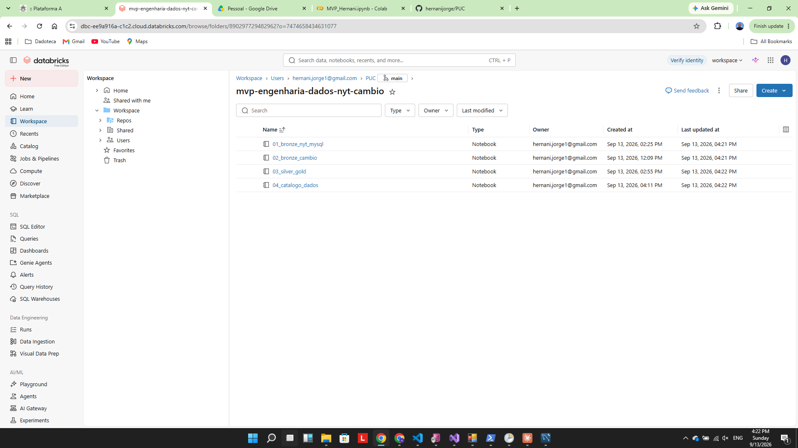
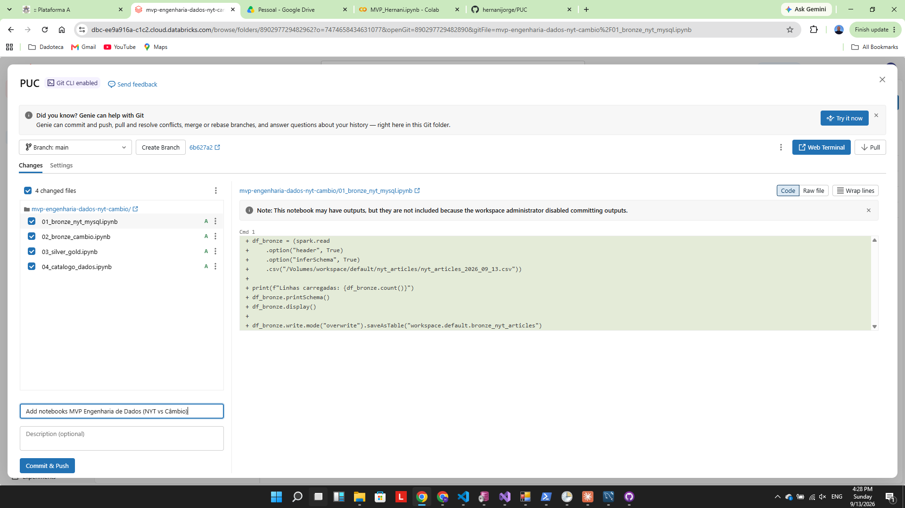

## Qualidade de Dados (Etapa 4.5)

Dois problemas de qualidade foram identificados e tratados durante o desenvolvimento do pipeline:

1. **Registros nulos em campos essenciais**: a `bronze_nyt_articles` contém registro(s) com `web_url`, `headline` ou `snippet` nulos já na origem (não é um artefato do processo de exportação/upload).
2. **Datas corrompidas por desalinhamento de colunas no CSV**: 314 de 78.002 registros (~0,4%) tinham o campo `published_date` corrompido — sinal de que, durante a exportação do MySQL Workbench, vírgulas não escapadas dentro de campos de texto (como `snippet`/`abstract`) deslocaram os valores das colunas seguintes. Tratamento aplicado: uso de `try_to_timestamp` (em vez de `to_timestamp`) para não interromper o pipeline, seguido de contagem explícita e remoção dos registros inválidos na camada Silver.

Além disso, foi investigada uma terceira questão, de **escopo/representatividade dos dados** em vez de qualidade técnica: amostras observadas durante a carga sugeriam artigos de culinária (seção Cooking do NYT). Uma consulta `GROUP BY section` sobre `silver_nyt_articles` mostrou que essa seção representa apenas ~2,2% do total — a suspeita não se confirmou, e o dataset é de fato um feed de notícias gerais do NYT (seções dominantes: U.S. 21,6%, World 13,9%, Arts 6,9%, Business 6,8%, Opinion 6,6%). Essa verificação motivou o ajuste consciente do enunciado do problema de negócio (de "notícias econômicas" para "notícias em geral"), documentado na seção de Contexto de Negócios e Perguntas.

**Evidências**:

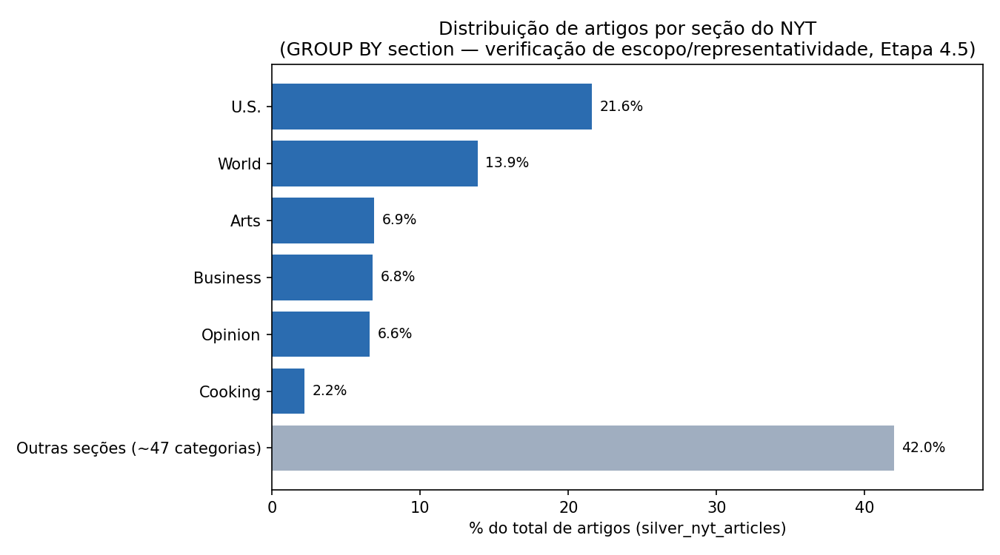
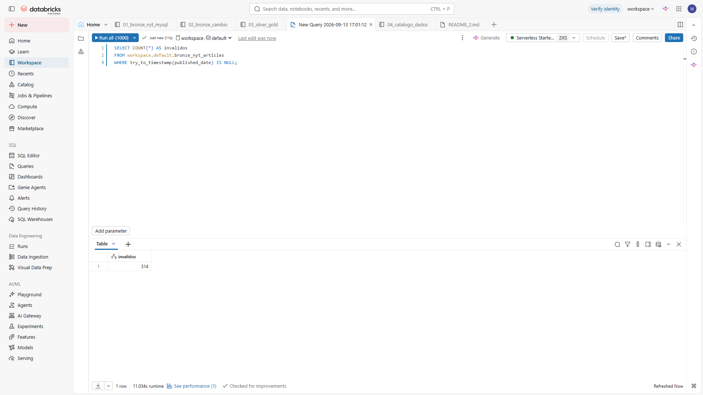

## Análise de Dados (Etapa 4.5)

A análise final foi feita sobre a tabela Gold `gold_analise_diaria` (401 dias, correspondentes à interseção entre dias com notícias do NYT e dias com cotação de câmbio disponível), calculando correlações de Pearson entre as variáveis de interesse, com checagem de significância estatística (nível de 5%):

| Pergunta | Par de variáveis | Correlação (r) | p-valor | Significativo? |
|---|---|---|---|---|
| P1 | Total de artigos/dia × \|retorno DXY\| (volatilidade) | -0,026 | 0,599 | Não |
| P2 | Sentimento médio × retorno DXY (mesmo dia) | 0,060 | 0,228 | Não |
| P3 | Sentimento médio (dia anterior) × retorno DXY | -0,078 | 0,119 | Não |
| P4 | Sentimento médio × retorno USD/BRL (mesmo dia) | 0,080 | 0,111 | Não |
| P4 | Sentimento médio (dia anterior) × retorno USD/BRL | 0,048 | 0,339 | Não |

**Conclusão**: nenhuma das correlações testadas atingiu significância estatística a 5% — todos os p-valores ficaram acima de 0,10. Ou seja, **não há evidência, nesta amostra, de relação linear relevante entre o volume ou o sentimento das notícias do NYT e os retornos diários do DXY ou do USD/BRL**, respondendo negativamente às quatro perguntas de negócio formuladas na etapa de Contexto.

Esse é considerado um resultado honesto e válido para este MVP, e não uma falha do pipeline. Algumas explicações possíveis, que ficam como limitações conhecidas e sugestões para trabalhos futuros:

- O dataset é uma cobertura **geral** do NYT, não filtrada para conteúdo econômico/financeiro (apenas ~7% das seções são explicitamente de negócios) — o sinal relevante para o câmbio pode estar diluído em meio a notícias de esportes, cultura, estilo de vida etc.
- O **VADER** é um léxico de sentimento de propósito geral, não calibrado especificamente para tom financeiro (onde palavras neutras no dia a dia podem ter forte carga de mercado, e vice-versa).
- A granularidade **diária** pode mascarar reações de mercado que ocorrem em escala intradiária.
- Os retornos de DXY e USD/BRL são influenciados por muitos outros fatores fora do escopo deste dataset (decisões de bancos centrais, divulgação de indicadores macroeconômicos, eventos geopolíticos não necessariamente cobertos pelo NYT no mesmo dia).
- A amostra de 401 dias, embora razoável para um MVP, é moderada para capturar efeitos estatísticos fracos.

**Trabalhos futuros**: filtrar o dataset para um subconjunto de seções mais diretamente relacionado a economia/mercado, testar um léxico de sentimento voltado para finanças (ex: Loughran-McDonald), e considerar defasagens maiores (2-3 dias) ou janelas semanais em vez de diárias.

**Evidências**:

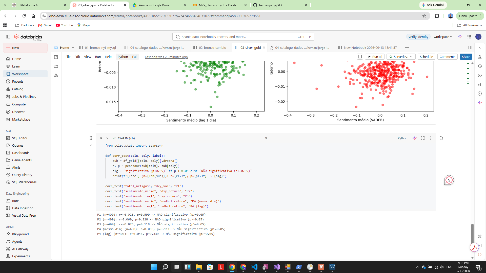

## Autoavaliação

> Esta seção é pessoal — personalize com sua própria experiência antes de entregar. Alguns pontos de partida, com base no que foi registrado durante o desenvolvimento:

- **Objetivos traçados no início vs. alcançados**: o objetivo era construir um pipeline de dados real (Bronze/Silver/Gold) em nuvem — em vez de uma análise pontual em pandas como no trabalho anterior — e usá-lo para responder P1-P4. O pipeline foi construído e todas as perguntas foram respondidas tecnicamente; o resultado (ausência de correlação significativa) é diferente do que a hipótese original sugeria, mas as perguntas foram, de fato, respondidas.
- **Principais dificuldades técnicas**: configuração inicial do ambiente (CLI do Databricks no Windows, com `winget` quebrado na máquina), instabilidade do schema das tabelas de câmbio ao longo de várias tentativas (sufixos de ticker do `yfinance` sendo herdados de forma inconsistente), e o próprio processo de exportação de dados do MySQL Workbench (bugs de encoding e de limite de linhas).
- **Principal aprendizado sobre os dados**: a importância de validar o escopo/representatividade de um dataset (via `GROUP BY`) antes de assumir que ele responde à pergunta de negócio original — isso evitou que a análise final fosse construída sobre uma premissa equivocada.
- **Sobre o resultado da análise**: as correlações encontradas foram estatisticamente não significativas. Isso é reportado com transparência, já que um MVP de engenharia de dados deve refletir o dado real, não uma narrativa favorável.
- **Trabalhos futuros**: ver seção de Análise de Dados acima (filtrar por seção relevante, léxico de sentimento financeiro, janelas temporais maiores).

---

## Estrutura do repositório

Este projeto vive em uma subpasta do repositório [hernanijorge/PUC](https://github.com/hernanijorge/PUC) (que reúne outros trabalhos da PUC), para manter tudo organizado por disciplina/projeto:

```
PUC/
├── (outros projetos existentes...)
└── mvp-engenharia-dados-nyt-cambio/
    ├── README.md
    ├── 01_bronze_nyt_mysql
    ├── 02_bronze_cambio
    ├── 03_silver_gold
    ├── 04_catalogo_dados
    └── screenshots/
        ├── carga/
        │   ├── bronze-nyt-mysql-execucao.png
        │   ├── volume-unity-catalog.png
        │   └── bronze-cambio-execucao.png
        ├── catalogo/
        │   ├── bronze-nyt-articles.png
        │   ├── gold-analise-diaria.png
        │   ├── bronze-dxy.png
        │   ├── silver-usdbrl.png
        │   └── script-comentarios.png
        ├── pipeline/
        │   ├── notebooks-repositorio.png
        │   └── git-commit-panel.png
        ├── qualidade/
        │   ├── distribuicao-secoes.png
        │   └── published-date-invalido.png
        └── analise/
            └── correlacoes-graficos.png
```

> Os 4 notebooks (`01_bronze_nyt_mysql`, `02_bronze_cambio`, `03_silver_gold`, `04_catalogo_dados`) ficam na raiz desta pasta — o Databricks os salva no formato de notebook (extensão real `.py` a depender da linguagem padrão de cada um), visíveis normalmente pelo GitHub.

## Como reproduzir

1. Criar um workspace Databricks (Free Edition é suficiente) com Unity Catalog habilitado.
2. Subir o CSV de artigos do NYT para um Volume do Unity Catalog (`/Volumes/<catalog>/<schema>/nyt_articles/`).
3. Executar os notebooks na ordem: `01_bronze_nyt_mysql` → `02_bronze_cambio` → `03_silver_gold` → `04_catalogo_dados`.
4. As bibliotecas `yfinance` e `vaderSentiment` podem ser instaladas via `%pip install yfinance vaderSentiment` na primeira célula dos notebooks correspondentes.
